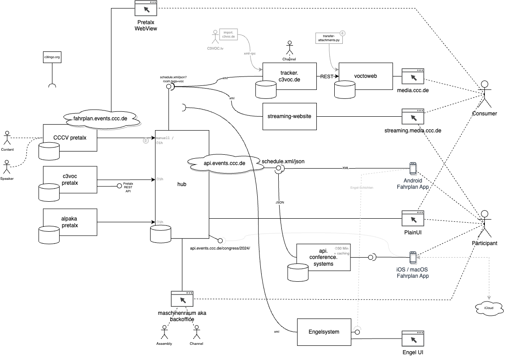

# schedule

Mono-Repo with various scripts and a library to generate, convert and validate [schedule files](https://c3voc.de/wiki/schedule) for events which use the [frab conference system][frab-website], [pretalx](https://github.com/pretalx/pretalx), or every other system able to generate schedule.json or CSV files in the correct format.

## Dependencies

### Debian and similar

```bash
sudo apt-get install python python-pip python-lxml libxslt1-dev libxml2-utils
pip3 install -r requirements.txt
pip3 install --pre gql[aiohttp]
```

### brew + poetry

```bash
brew install python3 poetry
poetry install
poetry env activate
```

If you have problems with `lxml` see https://stackoverflow.com/a/26544099/521791 

### brew + uv

```bash
brew install python uv
uv sync
source .venv/bin/activate
```

Install dev dependencies as well:

```bash
uv sync --group dev
```

Run scripts with uv without activating the environment:

```bash
uv run python schedule_39C3.py
```

## Local usage for 39C3

https://c3voc.de/wiki/events:39c3:schedule


```bash
mkdir 39c3
python3 schedule_39C3.py
```

## History

### 39C3

- https://c3voc.de/wiki/events:39c3:schedule

### 38C3

- https://c3voc.de/wiki/events:38c3:schedule
  

### 37C3

- https://c3voc.de/wiki/events:37c3:schedule

### CCCamp23

- https://c3voc.de/wiki/events:camp23:schedule

### JEV22

- https://c3voc.de/wiki/events:jev22:schedule

### rC3_21

- https://c3voc.de/wiki/events:jahresendveranstaltung2021:schedule
- https://git.cccv.de/rc3/schedule-2021

### rC3

- https://c3voc.de/wiki/events:rc3:schedule
- https://git.cccv.de/rc3/schedule

### 36C3

see also:

- https://github.com/n0emis/36c3-guid-fixer/

### 34C3

see [docs/data_flow_34C3_v0.7.pdf](docs/data_flow_34C3_v0.7.pdf) to get an overview and talk to @saerdnaer aka Andi if you have questions.

[frab-website]: http://frab.github.io/frab/
